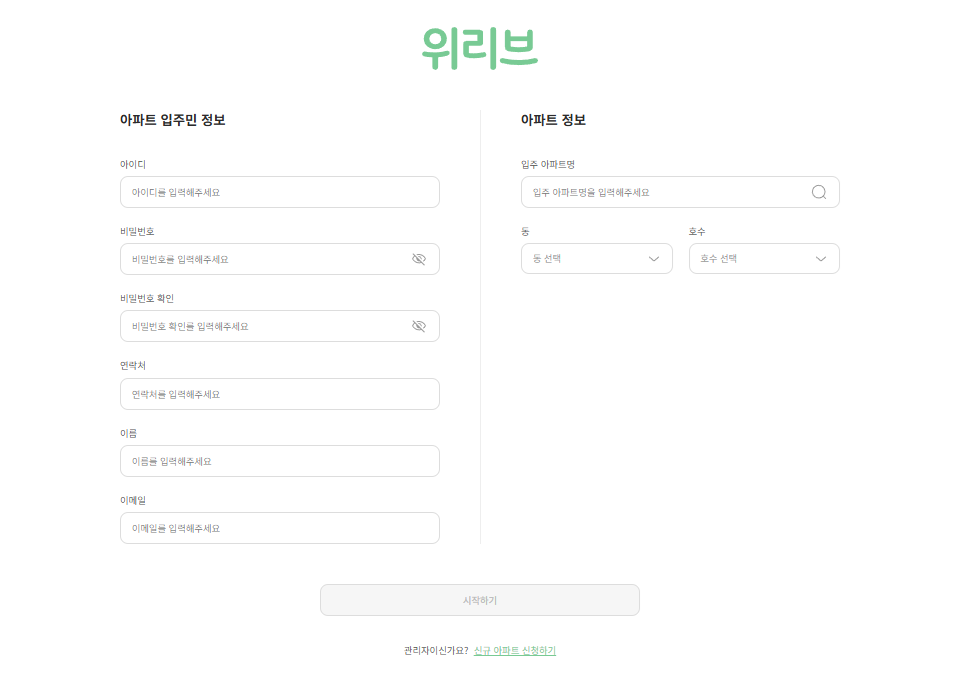
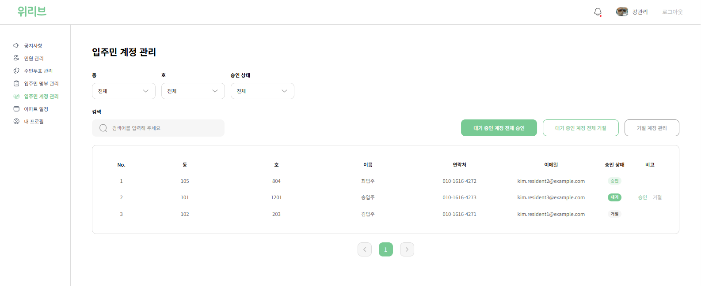
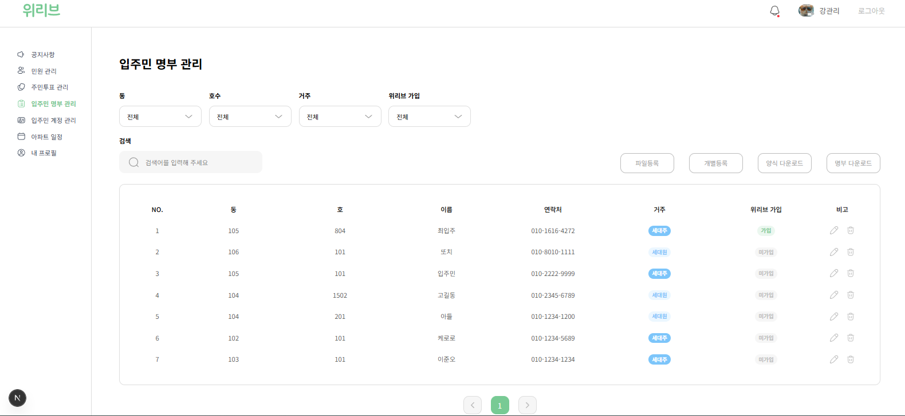
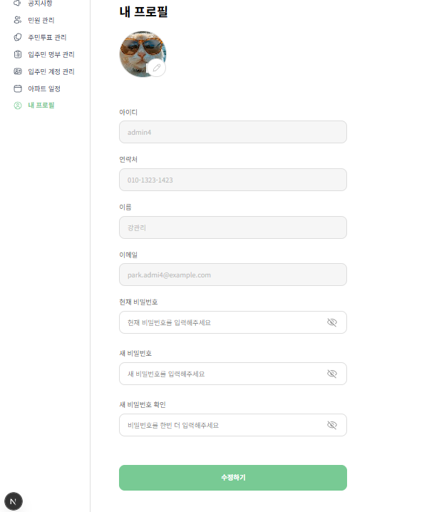

# 🧑‍💻 node.js 백엔드 팀 고급 프로젝트 - team2

---

## 👥 팀원 구성

| 이름       | 역할        | GitHub                                      | 개인 개발 블로그                               |
| ---------- | ----------- | ------------------------------------------- | ---------------------------------------------- |
| **김경연** | 백엔드 개발 | 🔗 [GitHub](이 소괄호 안에 url 작성)        | 🔗 [노션](이 소괄호 안에 url 작성)             |
| **김주호** | 백엔드 개발 | 🔗 [GitHub](https://github.com)             | 🔗 [노션](https://www.notion.com)              |
| **손훈석** | 백엔드 개발 | 🔗 [GitHub](https://github.com/HS-hand)     | 🔗 [velog](https://velog.io/@thsgnstjr7/posts) |
| **정인성** | 백엔드 개발 | 🔗 [GitHub](https://github.com/jung-insung) | 🔗 [velog](https://insungcoding.tistory.com/)  |

---

## 📘 프로젝트 소개

**프로그래밍 교육 사이트의 백엔드 시스템 구축**

- **프로젝트 기간:** 2026.01.05 ~
- **주요 목표:**
- ([팀 협업 문서 링크]())

---

## 🧰 기술 스택

| 구분                | 사용 기술                      |
| ------------------- | ------------------------------ |
| **Backend**         | Express.js, PrismaORM          |
| **Database**        | PostgreSQL                     |
| **공통 Tool**       | Git & GitHub, Discord, Notion  |
| **일정 관리**       | GitHub Issues, Notion 타임라인 |
| **GIT BRANCH 전략** | GIT FLOW                       |

---

## 🔧 팀원별 구현 기능 (자신이 개발한 기능 설명과 사진, gif 파일 첨부)

### 🟦 김경연

---

### 🟩 김주호

---

### 🟧 손훈석

### 주민 투표

**투표 등록**

- 관리자로 로그인할 시 주민 투표를 생성할 수 있습니다.
- 투표 등록 시 투표권자 범위(아파트 입주민 전체, 특정 동 주민 등)를 설정할 수 있습니다.
- 또한, 투표 시작 시간과 종료 시간을 설정할 수 있습니다.
- 아파트 일정에 자동으로 추가됩니다.

**투표 목록 조회**

- 관리자와 입주민은 제목, 작성자, 투표권자, 작성 일시, 투표 시작일, 투표 종료일, 투표 상태를 조회합니다.
- 입주민은 자신이 투표권자로 설정된 투표들만 참여 가능합니다.
- 투표권자와 투표 상태로 필터링이 가능하며, 검색이 가능합니다.

**투표 상세 조회**

- 제목, 투표권자, 투표 내용, 투표 선택 목록을 확인할 수 있습니다.
- 진행 중인 투표의 경우 투표를 실시할 수 있습니다.
- 투표 마감 시 관리자와 입주민 모두 투표 결과 조회가 가능하며, 마감된 투표는 자동으로 공지사항에 등록됩니다.

**투표 수정**

- 관리자는 투표 수정이 가능합니다.
- 관리자는 투표 상태를 변경할 수 있습니다.
- 투표가 이미 시작된 이후에는 수정이 불가능합니다.

**투표 삭제**

- 관리자는 투표 삭제가 가능합니다.
- 투표가 이미 시작된 이후에는 삭제가 불가능합니다.

**투표 상태 관리**

- 투표 시작 시간과 종료 시간을 기준으로 투표의 상태를 변경합니다.
    - 투표 전(`PENDING`), 투표 중(`IN_PROGRESS`), 마감(`CLOSED`)
- 상태 변경은 스케줄링을 통해 서버에서 자동으로 처리되어야 합니다.

### 공지사항

**공지 등록**

- 관리자의 경우 제목, 구분(일반, 중요) 등을 입력하여 공지사항 등록이 가능합니다.
- 공지사항에 등록되었을 경우 입주민에게 실시간 알림이 전송됩니다.
- 일정(시작일, 종료일) 등록 여부 선택이 가능하며 일정 등록 시 아파트 일정에 자동으로 추가됩니다.

**공지 목록 조회**

- 분류, 제목, 작성자, 등록 일시, 조회수, 댓글 수를 조회할 수 있습니다.
    - 분류는 정기검진, 긴급사항, 커뮤니티, 주민투표, 민원, 기타 총 6개가 있습니다.
- 분류로 필터링이 가능하며, 검색이 가능합니다.
- 관리자와 입주민 모두 공지사항 조회가 가능합니다.

**공지 상세 조회**

- 분류, 제목, 등록 일시, 조회수, 댓글수, 내용을 확인할 수 있으며, 댓글 목록을 확인할 수 있습니다.

**공지 수정**

- 관리자는 공지 수정이 가능합니다.

**공지 삭제**

- 관리자는 공지 삭제가 가능합니다.

### 참고자료
#### 공지사항


#### 투표


#### 일정


---

### 🟥 정인성

### 입주민 계정 관리 기능

- **회원가입**
  - 개인 정보: 아이디, 비밀번호, 연락처, 이름, 이메일
  - 거주 정보: 입주 아파트명, 동, 호수
  - 회원가입 시 즉시 계정이 활성화되지 않으며, 관리자 승인 `PENDING` 상태로 등록

- **관리자 승인 프로세스**
  - 아파트 관리자가 회원가입 요청을 승인하면 회원가입이 완료
  - 승인 결과는 다음 상태로 관리:
    - `PENDING` : 승인 대기 중 (로그인 불가능)
    - `APPROVED` : 승인 완료 (로그인 가능)
    - `REJECTED` : 승인 거절 (로그인 불가능)

- **입주민 계정 목록 조회**
  - 가입 상태(PENDING, APPROVED, REJECTED) 필터링
  - 아파트 동, 호수 필터링
  - 이름, 이메일 기준 검색
  - 페이지네이션 지원

- **주민 계정 가입 상태 변경 (단건)**
  - 승인 대기(PENDING) 상태의 계정을 승인 또는 거절로 변경

- **주민 계정 가입 상태 일괄 변경 (다건)**
  - 여러 개의 승인 대기(PENDING) 계정을 승인 또는 거절로 일괄 변경

- **거절된 주민 계정 일괄 삭제**
  - 가입 상태가 REJECTED인 주민 계정을 일괄 삭제

- **프로필 이미지 수정**
  - 입주민 계정의 프로필 이미지 수정
  - 프로필 이미지는 AWS S3에 저장 및 관리

- **비밀번호 변경**
  - 현재 비밀번호 확인 후 새 비밀번호로 변경
  - 비밀번호는 단방향 해싱 처리 후 데이터베이스에 저장

### 입주민 관리 기능 (가입 여부와 관계없이 입주민 통합 관리 (가입한 입주민 + 미가입한 입주민))

- **입주민 등록**
  - 개인 정보: 연락처, 이름, 이메일
  - 거주 정보: 동, 호수
  - Welive 미가입 입주민 등록 기능

- **입주민 목록 조회**
  - 아파트 동, 호수, Welive 가입 여부, 세대주/세대원 필터링
  - 이름, 이메일, 연락처 기준 검색
  - 페이지네이션 지원

- **입주민 상세 조회**
  - 입주민 ID 기준 상세 정보 제공
- **입주민 정보 수정**
  - 입주민 ID 기준 이메일, 연락처, 이름, 동, 호수, 세대주/세대원 수정 가능

- **입주민 정보 삭제**
  - 입주민 ID 기준 삭제

- **입주민 파일 업로드**
  - 새로운 입주민 정보가 들어있는 CSV 파일을 업로드
  - S3에 CSV 파일을 저장
  - S3에 저장된 CSV 파일을 읽어 DB에 입주민 정보를 일괄 등록

- **입주민 업로드 템플릿 다운로드**
  - 입주민 템플릿 CSV 파일을 다운로드

- **입주민 목록 파일 다운로드**
  - 등록된 입주민 목록을 CSV 파일로 다운로드

### 📸 주요 화면 미리보기

#### 입주민 회원가입

<p align="center">
  
</p>

#### 입주민 계정 관리

<p align="center">
  
</p>

#### 입주민 관리

<p align="center">
  
</p>

#### 내 프로필

<p align="center">
  
</p>

---

## 📁 파일 구조

```
src
├── clients.ts
├── config.ts
├── domain
│   ├── apartment
│   │   ├── apartment-mapper.ts
│   │   ├── controller
│   │   │   ├── apartment-controller.ts
│   │   │   ├── apartment-handler.ts
│   │   │   └── apartment-router.ts
│   │   ├── dto
│   │   │   ├── apartment-request.ts
│   │   │   └── view
│   │   │       ├── apartment-view.ts
│   │   │       └── apartments-view.ts
│   │   ├── entity
│   │   │   └── apartment-entity.ts
│   │   ├── interface
│   │   │   ├── i-apartment-command.ts
│   │   │   └── i-apartment-query.ts
│   │   ├── repo
│   │   │   ├── apartment-command.ts
│   │   │   └── apartment-query.ts
│   │   └── service
│   │       └── apartment-query.ts
│   ├── auth
│   │   ├── auth-service.ts
│   │   ├── controller
│   │   │   ├── auth-controller.ts
│   │   │   ├── auth-handler.ts
│   │   │   ├── auth-router.ts
│   │   │   └── view
│   │   │       └── log-in.ts
│   │   └── dto
│   │       └── auth-request.ts
│   ├── comment
│   │   ├── comment-entity.ts
│   │   ├── controller
│   │   │   ├── comment-controller.ts
│   │   │   ├── comment-handler.ts
│   │   │   └── comment-router.ts
│   │   ├── dto
│   │   │   ├── comment-request.ts
│   │   │   ├── comment-respose.ts
│   │   │   └── comment-view.ts
│   │   ├── interface
│   │   │   ├── i-comment-command-repo.ts
│   │   │   └── i-comment-query-repo.ts
│   │   ├── repo
│   │   │   ├── comment-command.ts
│   │   │   └── comment-query.ts
│   │   └── service
│   │       ├── comment-command.ts
│   │       └── comment-query.ts
│   ├── complaint
│   │   ├── complaint-entity.ts
│   │   ├── complaint-scheduler.ts
│   │   ├── controller
│   │   │   ├── complaint-controller.ts
│   │   │   ├── complaint-handler.ts
│   │   │   └── complaint-router.ts
│   │   ├── dto
│   │   │   ├── complaint-request.ts
│   │   │   ├── complaint-response.ts
│   │   │   └── complaint-veiw.ts
│   │   ├── interface
│   │   │   ├── i-complaint-command-repo.ts
│   │   │   └── i-complaint-query-repo.ts
│   │   ├── repo
│   │   │   ├── complaint-command.ts
│   │   │   └── complaint-query.ts
│   │   └── service
│   │       ├── complaint-batch.ts
│   │       ├── complaint-command.ts
│   │       └── complaint-query.ts
│   ├── notice
│   │   ├── controller
│   │   │   ├── notice-controller.ts
│   │   │   ├── notice-handler.ts
│   │   │   └── notice-router.ts
│   │   ├── dto
│   │   │   ├── event-request.ts
│   │   │   ├── event-view.ts
│   │   │   ├── notice-request.ts
│   │   │   └── notice-view.ts
│   │   ├── entity
│   │   │   ├── event.ts
│   │   │   └── notice.ts
│   │   ├── interface
│   │   │   ├── i-event-query-repo.ts
│   │   │   ├── i-notice-command-repo.ts
│   │   │   └── i-notice-query-repo.ts
│   │   ├── notice-scheduler.ts
│   │   ├── repo
│   │   │   ├── notice-command.ts
│   │   │   └── notice-query.ts
│   │   └── service
│   │       ├── notice-batch.ts
│   │       ├── notice-command.ts
│   │       └── notice-query.ts
│   ├── notification
│   │   ├── controller
│   │   │   ├── notification-controller.ts
│   │   │   ├── notification-handler.ts
│   │   │   └── notification-router.ts
│   │   ├── dto
│   │   │   ├── notification-request.ts
│   │   │   └── view
│   │   │       └── notification-view.ts
│   │   ├── entity
│   │   │   └── notification.ts
│   │   ├── interface
│   │   │   ├── i-notification-command.ts
│   │   │   └── i-notification-query.ts
│   │   ├── notification-mapper.ts
│   │   ├── notification-scheduler.ts
│   │   ├── repo
│   │   │   ├── notification-command.ts
│   │   │   └── notification-query.ts
│   │   └── service
│   │       ├── notification-command.ts
│   │       └── notification-query.ts
│   ├── poll
│   │   ├── controller
│   │   │   ├── poll-controller.ts
│   │   │   ├── poll-handler.ts
│   │   │   └── poll-router.ts
│   │   ├── dto
│   │   │   ├── poll-request.ts
│   │   │   └── poll-view.ts
│   │   ├── entity
│   │   │   ├── option.ts
│   │   │   └── poll.ts
│   │   ├── interface
│   │   │   ├── i-poll-command-repo.ts
│   │   │   └── i-poll-query-repo.ts
│   │   ├── repo
│   │   │   ├── poll-command.ts
│   │   │   └── poll-query.ts
│   │   └── service
│   │       ├── poll-command.ts
│   │       └── poll-query.ts
│   ├── state
│   │   ├── dto
│   │   │   ├── state-request.ts
│   │   │   └── state-response.ts
│   │   ├── entity
│   │   │   └── state.ts
│   │   ├── interface
│   │   │   └── i-state-command-repo.ts
│   │   ├── repo
│   │   │   └── state-command.ts
│   │   └── service
│   │       └── state-command.ts
│   ├── user
│   │   ├── controller
│   │   │   ├── resident-user-controller.ts
│   │   │   ├── resident-user-handler.ts
│   │   │   ├── resident-user-router.ts
│   │   │   ├── user-controller.ts
│   │   │   ├── user-handler.ts
│   │   │   └── user-router.ts
│   │   ├── dto
│   │   │   ├── admin-response.ts
│   │   │   ├── common-schema.ts
│   │   │   ├── import-resident-row-dto.ts
│   │   │   ├── resident-user-response.ts
│   │   │   ├── user-request.ts
│   │   │   └── view
│   │   │       ├── administrator.ts
│   │   │       ├── resident.ts
│   │   │       └── user-view.ts
│   │   ├── entity
│   │   │   ├── admin-account.ts
│   │   │   ├── base-user.ts
│   │   │   ├── not-joined-resident.ts
│   │   │   ├── resident-account.ts
│   │   │   └── vo
│   │   │       ├── resident-address.ts
│   │   │       └── user-apartment-link.ts
│   │   ├── interface
│   │   │   ├── i-user-command-repo.ts
│   │   │   └── i-user-query-repo.ts
│   │   ├── repo
│   │   │   ├── user-command.ts
│   │   │   └── user-query.ts
│   │   ├── service
│   │   │   ├── user-command.ts
│   │   │   └── user-query.ts
│   │   └── user-mapper.ts
│   └── user-vote-option
│       ├── i-user-vote-option-command-repo.ts
│       ├── user-vote-option-command-repo.ts
│       └── user-vote-option-entity.ts
├── index.ts
├── injector.ts
├── managers
│   ├── bcrypt-hash-manager.ts
│   ├── redis-locker.ts
│   └── unit-of-work.ts
├── middlewares
│   ├── auth-middleware.ts
│   ├── global-error-middleware.ts
│   ├── multer-middleware.ts
│   └── not-found-middleware.ts
├── redis.ts
├── servers
│   └── http-server.ts
├── shared
│   ├── base-command-repo.ts
│   ├── exception
│   │   ├── business-exception
│   │   │   ├── business-exception.ts
│   │   │   └── exception-info.ts
│   │   └── technical-exception
│   │       ├── exception-info.ts
│   │       └── technical-exception.ts
│   ├── interface
│   │   ├── i-bcrypt-hash-manager.ts
│   │   ├── i-controllers.ts
│   │   ├── i-file-manager.ts
│   │   ├── i-middlewares.ts
│   │   ├── i-page-view.ts
│   │   ├── i-redis-locker.ts
│   │   ├── i-redis.ts
│   │   ├── i-token-manager.ts
│   │   └── i-unit-of-work.ts
│   ├── types
│   │   └── express.d.ts
│   └── utils
│       ├── async-context-storage-util.ts
│       ├── controller-util.ts
│       ├── file-manager.ts
│       ├── file-storage.ts
│       ├── redis-keys.ts
│       ├── scheduler-util.ts
│       └── token-manager.ts
├── swagger-documentation.json
├── swagger.ts
└── test
    ├── e2e
    │   ├── comment.test.ts
    │   ├── complaint.test.ts
    │   ├── notice.test.ts
    │   ├── poll.test.ts
    │   └── user.test.ts
    ├── k6
    │   └── k6-test.js
    ├── mock
    │   ├── create-user.js
    │   └── user-connect-sse.js
    └── unit
        ├── comment-service.test.ts
        ├── complaint-service.test.ts
        └── user-command-service.test.ts
```
